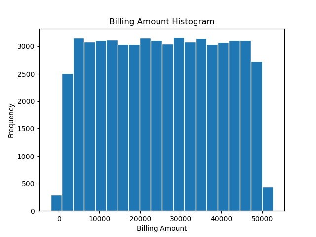

Healthcare Dataset Describe:
shape: (9, 3)
┌────────────┬───────────┬────────────────┐
│ statistic  ┆ Age       ┆ Billing Amount │
│ ---        ┆ ---       ┆ ---            │
│ str        ┆ f64       ┆ f64            │
╞════════════╪═══════════╪════════════════╡
│ count      ┆ 55500.0   ┆ 55500.0        │
│ null_count ┆ 0.0       ┆ 0.0            │
│ mean       ┆ 51.539459 ┆ 25539.316097   │
│ std        ┆ 19.602454 ┆ 14211.454431   │
│ min        ┆ 13.0      ┆ -2008.49214    │
│ 25%        ┆ 35.0      ┆ 13241.433786   │
│ 50%        ┆ 52.0      ┆ 25538.524706   │
│ 75%        ┆ 68.0      ┆ 37820.489293   │
│ max        ┆ 89.0      ┆ 52764.276736   │
└────────────┴───────────┴────────────────┘
Histogram of Billing Amount Distribution
